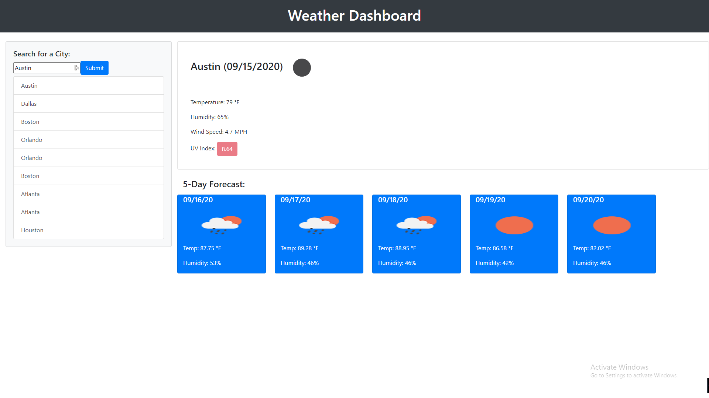

# Before-You-Step-Out-the-Door

A weather app using the Open Weather Map API to retrieve weather in a location where the user wants to know about.

## Preview

## Where to access

Access website: [Get Your City Forecast Here](https://mbpjason.github.io/Before-You-Step-Out-the-Door/)

## Accessability

Mobile responsive. Alt tags given to images.

## Clean Code

Made sure that code was properly formatted and easily readable for anyone to look at.
Gave detail comments for what is happening in the JS file and sectioned off the big parts so it is easy to look at.

## How it performs

Grabs data from Open Weather API. API gets called twice so that it can grab data and properly populate the webpage with not issues in loading.